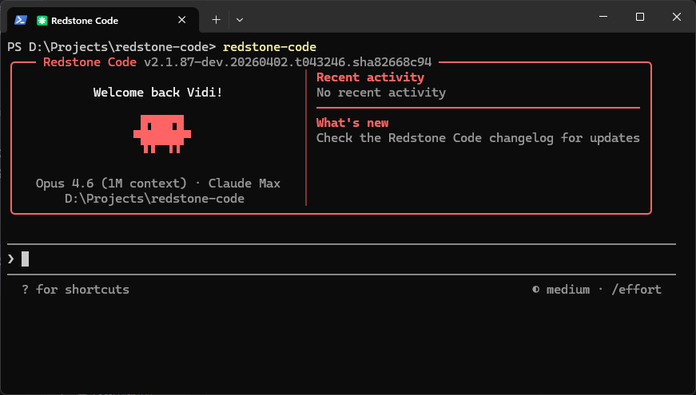

<p align="center">
  
</p>

<h1 align="center">Redstone Code</h1>

<p align="center">
  <strong>An agentic coding CLI, rebuilt from the ground up.</strong><br>
  Multi-provider support. No telemetry. No guardrails. All experimental features unlocked.<br>
  One binary, zero callbacks home.
</p>

<p align="center">
  <a href="#quick-install"></a>
  <a href="https://github.com/veedy-dev/redstone-code/stargazers"></a>
  <a href="https://github.com/veedy-dev/redstone-code/issues"></a>
  <a href="https://github.com/veedy-dev/redstone-code/blob/main/FEATURES.md"></a>
</p>

---

## Highlights

- **Multi-provider hot-swap** -- Switch between Anthropic, MiniMax, OpenAI Codex, AWS Bedrock, Vertex AI, and any Anthropic-compatible endpoint mid-session via `/login`. No restart needed.
- **Provider profiles** -- Save and manage multiple API providers. Add a custom endpoint once, switch back and forth with one click.
- **Zero telemetry** -- All outbound analytics, crash reports, and session fingerprinting are removed at build time.
- **No prompt guardrails** -- Hardcoded refusal patterns and injected restriction overlays are stripped. The model's own safety training still applies.
- **54 experimental features unlocked** -- Every feature flag that compiles cleanly is enabled in the full build. See [FEATURES.md](FEATURES.md).

---

## Quick Install

### macOS / Linux

```bash
curl -fsSL https://raw.githubusercontent.com/veedy-dev/redstone-code/main/install.sh | bash
```

### Windows (PowerShell)

```powershell
irm https://raw.githubusercontent.com/veedy-dev/redstone-code/main/install.ps1 | iex
```

Checks your system, installs Bun if needed, clones the repo, builds with all experimental features enabled, and puts `redstone-code` on your PATH.

Then run `redstone-code` and use the `/login` command to authenticate with your preferred provider.

---

## Table of Contents

- [Highlights](#highlights)
- [Quick Install](#quick-install)
- [Model Providers](#model-providers)
- [Provider Profiles](#provider-profiles)
- [Requirements](#requirements)
- [Build](#build)
- [Usage](#usage)
- [Experimental Features](#experimental-features)
- [Project Structure](#project-structure)
- [Tech Stack](#tech-stack)
- [Contributing](#contributing)
- [License](#license)

---

## Model Providers

Redstone Code supports **six provider types** out of the box. Use the `/login` command or set environment variables to switch providers.

### Anthropic (Direct API) -- Default

Use Anthropic's first-party API directly.

```bash
redstone-code
# Then /login and select "Anthropic Console account"
```

### Custom Anthropic-Compatible Endpoints

Any provider that implements the Anthropic Messages API format works out of the box. Examples: [MiniMax](https://platform.minimax.io), or any Anthropic-compatible proxy.

```bash
redstone-code
# Then /login > "Custom provider" > enter base URL, API key, and model name
```

Or via environment variables:

```bash
export ANTHROPIC_BASE_URL="https://api.minimax.io/anthropic"
export ANTHROPIC_AUTH_TOKEN="your-api-key"
export ANTHROPIC_MODEL="MiniMax-M2.7"
redstone-code
```

### OpenAI Codex

Use OpenAI's Codex models. Requires a Codex subscription.

| Model | ID |
|---|---|
| GPT-5.4 | `gpt-5.4` |
| GPT-5.3 Codex | `gpt-5.3-codex` |
| GPT-5.4 Mini | `gpt-5.4-mini` |

```bash
redstone-code
# Then /login and select "OpenAI Codex account"
```

### AWS Bedrock

Route requests through your AWS account via Amazon Bedrock.

```bash
export CLAUDE_CODE_USE_BEDROCK=1
export AWS_REGION="us-east-1"
redstone-code
```

Uses your standard AWS credentials (environment variables, `~/.aws/config`, or IAM role).

### Google Cloud Vertex AI

Route requests through your GCP project via Vertex AI.

```bash
export CLAUDE_CODE_USE_VERTEX=1
redstone-code
```

Uses Google Cloud Application Default Credentials (`gcloud auth application-default login`).

### Anthropic Foundry

Use Anthropic Foundry for dedicated deployments.

```bash
export CLAUDE_CODE_USE_FOUNDRY=1
export ANTHROPIC_FOUNDRY_API_KEY="..."
redstone-code
```

### Provider Summary

| Provider | Setup | Auth |
|---|---|---|
| Anthropic (default) | `/login` | API key or OAuth |
| Custom endpoint | `/login` > Custom provider | API key |
| OpenAI Codex | `/login` | OAuth via OpenAI |
| AWS Bedrock | `CLAUDE_CODE_USE_BEDROCK=1` | AWS credentials |
| Google Vertex AI | `CLAUDE_CODE_USE_VERTEX=1` | `gcloud` ADC |
| Anthropic Foundry | `CLAUDE_CODE_USE_FOUNDRY=1` | API key |

---

## Provider Profiles

Redstone Code lets you save multiple provider configurations and switch between them without restarting.

### Adding a provider

1. Run `/login`
2. Select **Custom provider**
3. Enter the provider name, base URL, and API key
4. Redstone Code auto-discovers available models (falls back to manual entry)
5. The provider is saved and activated immediately

### Switching providers

Run `/login` again. Saved providers appear at the top of the screen:

```
Switch provider or login:

> MiniMax (current) - MiniMax-M2.7
  Anthropic - Default account

  Set up new login:
  1. Subscription account
  2. Console account (API billing)
  3. 3rd-party platform (Bedrock, Foundry, Vertex)
  4. Custom provider (Anthropic-compatible endpoint)
  5. OpenAI Codex account
```

Select any saved provider to hot-swap mid-session. The API client, model list, and auth are all updated instantly.

### How it works

- Profiles are stored in `~/.claude/claude.json` under `providerProfiles`
- The active profile's environment variables (`ANTHROPIC_BASE_URL`, `ANTHROPIC_AUTH_TOKEN`, `ANTHROPIC_MODEL`) are set at runtime
- Original env vars are stashed and restored when switching back
- Cached models auto-refresh every 24 hours

---

## Requirements

- **Runtime**: [Bun](https://bun.sh) >= 1.3.11
- **OS**: macOS, Linux, or Windows (native or WSL)
- **Auth**: An API key or OAuth login for your chosen provider

```bash
# Install Bun if you don't have it
curl -fsSL https://bun.sh/install | bash
```

---

## Build

```bash
git clone https://github.com/veedy-dev/redstone-code.git
cd redstone-code
bun install
bun run build
./cli
```

### Build Variants

| Command | Output | Features | Description |
|---|---|---|---|
| `bun run build` | `./cli` | `VOICE_MODE` only | Production-like binary |
| `bun run build:dev` | `./cli-dev` | `VOICE_MODE` only | Dev version stamp |
| `bun run build:dev:full` | `./cli-dev` | All 54 experimental flags | Full unlock build |
| `bun run compile` | `./dist/cli` | `VOICE_MODE` only | Alternative output path |

### Custom Feature Flags

Enable specific flags without the full bundle:

```bash
# Enable just ultraplan and ultrathink
bun run ./scripts/build.ts --feature=ULTRAPLAN --feature=ULTRATHINK

# Add a flag on top of the dev build
bun run ./scripts/build.ts --dev --feature=BRIDGE_MODE
```

---

## Usage

```bash
# Interactive REPL (default)
./cli

# One-shot mode
./cli -p "what files are in this directory?"

# Specify a model
./cli --model claude-opus-4-6

# Run from source (slower startup)
bun run dev

# Login / switch providers
./cli /login

# Switch model
./cli /model
```

### Environment Variables

| Variable | Purpose |
|---|---|
| `ANTHROPIC_API_KEY` | API key |
| `ANTHROPIC_AUTH_TOKEN` | Auth token (alternative) |
| `ANTHROPIC_MODEL` | Override default model |
| `ANTHROPIC_BASE_URL` | Custom API endpoint |
| `ANTHROPIC_DEFAULT_OPUS_MODEL` | Custom Opus model ID |
| `ANTHROPIC_DEFAULT_SONNET_MODEL` | Custom Sonnet model ID |
| `ANTHROPIC_DEFAULT_HAIKU_MODEL` | Custom Haiku model ID |

---

## Experimental Features

The `bun run build:dev:full` build enables all 54 working feature flags. Highlights:

### Interaction & UI

| Flag | Description |
|---|---|
| `ULTRAPLAN` | Remote multi-agent planning (Opus-class) |
| `ULTRATHINK` | Deep thinking mode -- type "ultrathink" to boost reasoning effort |
| `VOICE_MODE` | Push-to-talk voice input and dictation |
| `TOKEN_BUDGET` | Token budget tracking and usage warnings |
| `HISTORY_PICKER` | Interactive prompt history picker |
| `MESSAGE_ACTIONS` | Message action entrypoints in the UI |
| `QUICK_SEARCH` | Prompt quick-search |
| `SHOT_STATS` | Shot-distribution stats |

### Agents, Memory & Planning

| Flag | Description |
|---|---|
| `BUILTIN_EXPLORE_PLAN_AGENTS` | Built-in explore/plan agent presets |
| `VERIFICATION_AGENT` | Verification agent for task validation |
| `AGENT_TRIGGERS` | Local cron/trigger tools for background automation |
| `AGENT_TRIGGERS_REMOTE` | Remote trigger tool path |
| `EXTRACT_MEMORIES` | Post-query automatic memory extraction |
| `COMPACTION_REMINDERS` | Smart reminders around context compaction |
| `CACHED_MICROCOMPACT` | Cached microcompact state through query flows |
| `TEAMMEM` | Team-memory files and watcher hooks |

### Tools & Infrastructure

| Flag | Description |
|---|---|
| `BRIDGE_MODE` | IDE remote-control bridge (VS Code, JetBrains) |
| `BASH_CLASSIFIER` | Classifier-assisted bash permission decisions |
| `PROMPT_CACHE_BREAK_DETECTION` | Cache-break detection in compaction/query flow |

See [FEATURES.md](FEATURES.md) for the complete audit of all 88 flags, including 34 broken flags with reconstruction notes.

---

## Project Structure

```
scripts/
  build.ts                # Build script with feature flag system

src/
  entrypoints/cli.tsx     # CLI entrypoint
  commands.ts             # Command registry (slash commands)
  tools.ts                # Tool registry (agent tools)
  QueryEngine.ts          # LLM query engine
  screens/REPL.tsx        # Main interactive UI (Ink/React)

  commands/               # /slash command implementations
  tools/                  # Agent tool implementations (Bash, Read, Edit, etc.)
  components/             # Ink/React terminal UI components
  hooks/                  # React hooks
  services/               # API clients, MCP, OAuth
    api/                  # API client + fetch adapters
    oauth/                # OAuth flows
  state/                  # App state store
  utils/                  # Utilities
    model/                # Model configs, providers, validation
    providerProfiles.ts   # Provider profile CRUD, discovery, hot-swap
  skills/                 # Skill system
  plugins/                # Plugin system
  bridge/                 # IDE bridge
  voice/                  # Voice input
  tasks/                  # Background task management
```

---

## Tech Stack

| | |
|---|---|
| **Runtime** | [Bun](https://bun.sh) |
| **Language** | TypeScript |
| **Terminal UI** | React + [Ink](https://github.com/vadimdemedes/ink) |
| **CLI Parsing** | [Commander.js](https://github.com/tj/commander.js) |
| **Schema Validation** | Zod v4 |
| **Code Search** | ripgrep (bundled) |
| **Protocols** | MCP, LSP |
| **APIs** | Anthropic Messages, OpenAI Codex, AWS Bedrock, Google Vertex AI |

---

## Contributing

Contributions are welcome. If you're working on restoring one of the 34 broken feature flags, check the reconstruction notes in [FEATURES.md](FEATURES.md) first -- many are close to compiling and just need a small wrapper or missing asset.

1. Fork the repository
2. Create a feature branch (`git checkout -b feat/my-feature`)
3. Commit your changes (`git commit -m 'feat: add something'`)
4. Push to the branch (`git push origin feat/my-feature`)
5. Open a Pull Request

---

## License

This project is based on a publicly available source snapshot. Use at your own discretion.
